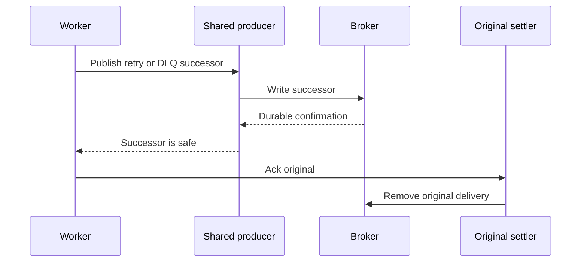
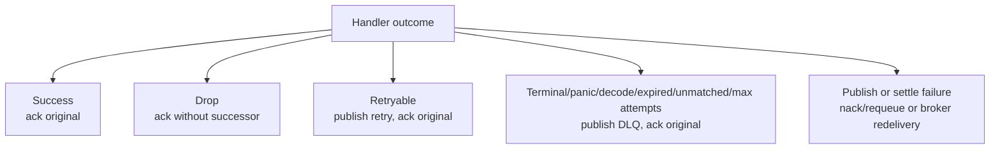
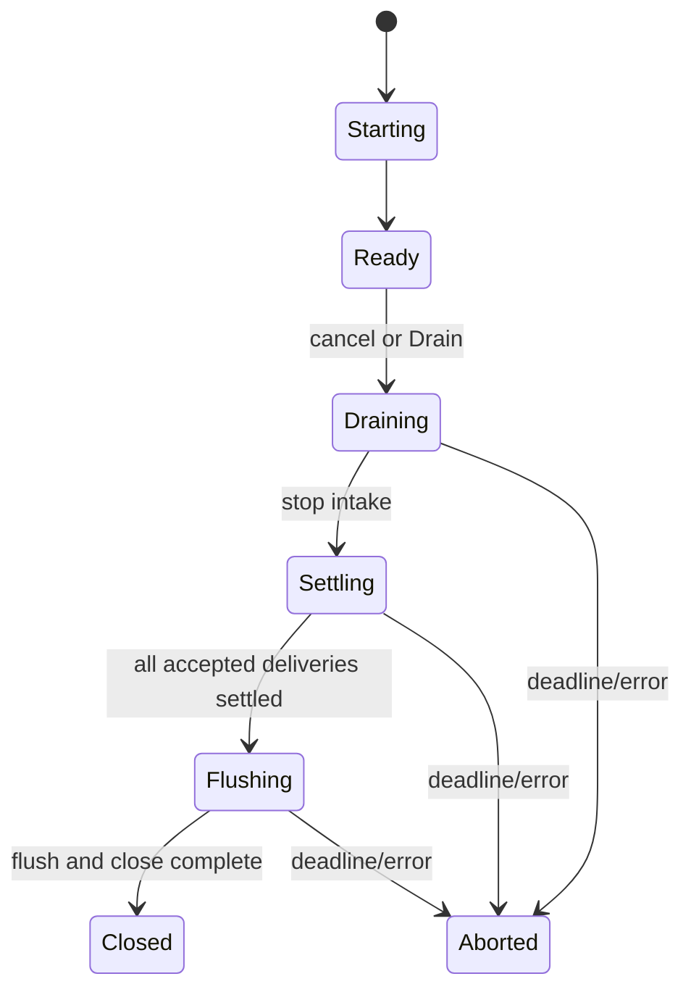

# Settlement and shutdown

## Settle-last rule

The SDK does not claim exactly-once effects. A crash after successor confirmation but before the
original acknowledgement can produce a duplicate. The stable idempotency key lets the application
make its effect safe to repeat.

## Outcomes

The error helpers are in [`errors.go`](../errors.go). Retry ladder mechanics are in
[`internal/retry`](../internal/retry). DLQ and retry publication are in [`worker.go`](../worker.go).

## In-flight accounting

[`internal/dispatch/registry.go`](../internal/dispatch/registry.go) records two separate axes:

| Axis | Values |
| --- | --- |
| settlement result | settled, requeued, unknown, abandoned |
| message disposition | handled, retried, dead-lettered, requeued |

This distinction matters: a message can have a known intended disposition but an unknown settlement
result if the broker operation did not return success.

## Runner drain

`Runner.Drain` cancels intake, gives handlers a bounded grace period, and waits for the runner
goroutines. `Client.Close` drains all registered runners, waits for active publishes, flushes the
shared producer, closes producer/connection resources, and only then marks the client closed.

The lifecycle implementation is in [`internal/lifecycle`](../internal/lifecycle). The runner
integration is in `Runner.Drain`, `Runner.Run`, and `finishRunner`.

## Stuck handlers

Handlers receive a timeout context. A non-cooperative handler is observed as stuck after the
configured threshold; shutdown does not wait forever for code that ignores cancellation. The
delivery is recorded as abandoned or requeued according to the final settlement path.
